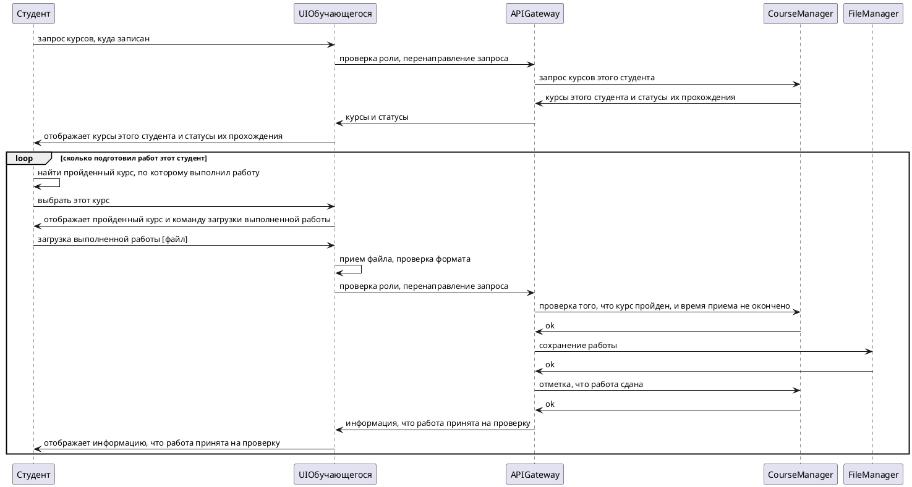
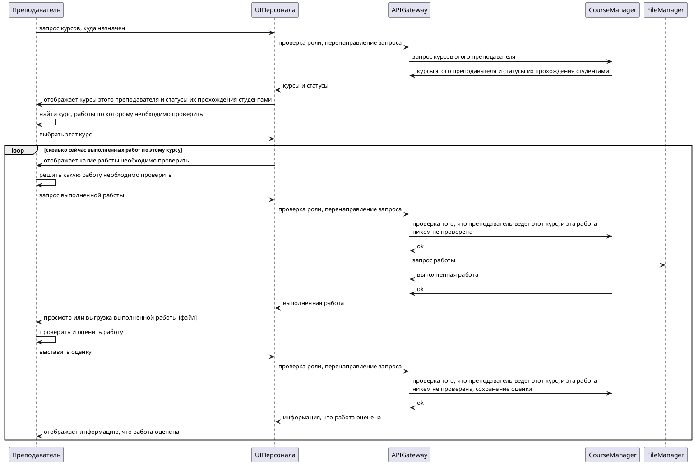

- [Title](#title)
- [Status](#status)
- [Context](#context)
- [Drivers](#drivers)
- [Problem](#problem)
- [Alternatives](#alternatives)
  - [1. По структуре связи:](#1-по-структуре-связи)
  - [2. По классификации API\BUS\API Gateway](#2-по-классификации-apibusapi-gateway)
  - [3. По связности:](#3-по-связности)
  - [4. По протоколу:](#4-по-протоколу)
- [Decision](#decision)
  - [1. Описание выбранного решения](#1-описание-выбранного-решения)
  - [2. Иллюстрация решения](#2-иллюстрация-решения)
    - [2.1 Иллюстрация структуры связи, выбранных интерфейсов \ протоколов](#21-иллюстрация-структуры-связи-выбранных-интерфейсов--протоколов)
    - [2.2 Иллюстрация асинхронного взаимодействия](#22-иллюстрация-асинхронного-взаимодействия)
      - [Диаграмма последовательности при загрузке работы (1)](#диаграмма-последовательности-при-загрузке-работы-1)
      - [Диаграмма последовательности при проверке работы (2)](#диаграмма-последовательности-при-проверке-работы-2)
  - [3. Фактор принятия решения](#3-фактор-принятия-решения)

# Title
Выбор шаблонов и стилей интеграции

# Status
Proposed

# Context
Для системы:
-  состоящей из разнородных модулей, с отличающимися друг от друга многими свойствами (назначением, режимом использования, технологией реализации и пр.),
-  взаимодействующей с внешними системами, а также
-  развивающейся поэтапно,

требуется определить шаблоны и стили интеграции.

# Drivers
Факторы, влияющие на решение:
1. В момент проведения воркшопа для гостей (онлайн-хакатон, всероссийский тотальный диктант и т. д.), либо при запуске нового востребованного курса, гости \ студенты будут обращаться к системе (почти) одновременно, а также будут ждать одновременной работы с ними преподавателей.
2. При проверке заданий по конкурсам или итоговых работ по курсу, гости \ студенты действуют не согласованно.

# Problem
Повышенная нагрузка на систему в моменты проведения воркшопов или новых курсов может привести к потере части обращений, если система не будет справляться с их обработкой в такие моменты времени.

# Alternatives
## 1. По структуре связи:
Шаблоны интеграционного взаимодействия по структуре связи:
- Точка-точка, посредством прямого вызова модулей друг друга, используемой в случае, если число модулей невелико, и они не могут быть унифицированы (или в этом нет смысла).
- Звезда, посредством только интегрирующей среды взаимодействия, реализующий универсальный интерфейс для доступа всех модулей.
- Смешанное, посредством единой шины и прямого вызова.

## 2. По классификации API\BUS\API Gateway
Шаблоны интеграционного взаимодействия по классификации API\BUS\API Gateway:
- Посредством API, напрямую между модулями.
- Посредством BUS - единой шины, используемой при подключении большого числа модулей или внешних систем с типовыми структурами и событиями.
- Посредством API Gateway - шлюза, когда внутри запросов требуется обеспечить доступ к данным, бизнес‑логике или функциональным возможностям одновременно нескольких модулей.

## 3. По связности:
Шаблоны интеграционного взаимодействия по связности:
- Синхронное, когда требуется немедленный ответ на запрос.
- Асинхронное, когда ответ на запрос допускается выдать через некоторое время.

## 4. По протоколу:
Шаблоны интеграционного взаимодействия по протоколу:
- REST, который
  - широко распространен,
  - легко запускается и отлаживается,
  - не фиксирует схему данных,
  - используется при синхронном взаимодействии.
- GraphQL, который
  - предоставляет возможность вызова нескольких взаимосвязанных функций в рамках одного запроса,
  - фиксирует схему данных,
  - может работать с более сложными структурами, чем REST,
  - может использоваться при асинхронном и синхронном взаимодействии.
- gRPC, который
  - фиксирует схему данных,
  - имеет высокую производительность,
  - требует настройку отдельного клиента и сервиса,
  - более сложный в использовании, чем REST.

# Decision
## 1. Описание выбранного решения
Мы будем использовать следующие шаблоны:
- По структуре связи:
  - Точка-точка, так как унификация разнородных модулей не целесообразна.

- По классификации интерфейса API \ BUS \ API Gateway:
  - Частично посредством API, так как:
    - некоторые модули используются в определенном случае (старая система Поколение-М, Система дистрибьюции контента, Корпоративный университет МТС), имеют унифицированный стандарт взаимодействия (Реляционная СУБД),
    - быстрее обеспечить их подключение.
  - Главным образом, посредством API Gateway, так как
    - будет единая точка входа для запросов от разных веб-приложений (Пользовательский интерфейс обучающихся, Пользовательский интерфейс персонала), вспомогательных сервисов (Приложение миграции данных), а также модулей, которые могут понадобится после MVP (WASD, Enablement Platform)
    - обеспечивается возможность подключения новых модулей или замены одних модулей на другие без переработки веб-приложений, всей схемы взаимодействия модулей.

- По связности:
  - Синхронное в процессе проведения воркшопа \ нового востребованного курса, где гости \ студенты будут обращаться к системе (почти) одновременно, а преподаватели с ними должны взаимодействовать в режиме realtime, и на этом участке требуется высокая согласованность данных.
  - Асинхронное проверке заданий по конкурсам или итоговых работ по курсу, так как этот формат активности предполагает наличие некоторого периода времени (дни, недели), когда работы будут поступать, а затем проверяться.

- По протоколу:
  - REST в формате JSON, так как он отлично подходит для работы с простыми структурами данных (элементы образовательной программы, учет учебных материалов и выполненных заданий, данные о пользователях).

## 2. Иллюстрация решения

### 2.1 Иллюстрация структуры связи, выбранных интерфейсов \ протоколов
Иллюстрация структуры связи модулей, выбранных интерфейсов \ протоколов взаимодействия для конкретных модулей показаны на [Диаграмме контейнеров](../c4/containers.md).

### 2.2 Иллюстрация асинхронного взаимодействия

Иллюстрация асинхронного взаимодействия при обучении, когда:
- студенты загружают выполненные работы (диаграмма 1),
- преподаватель проверяет эти работы (диаграмма 2) независимо от процесса загрузки (диаграмма 2).
При этом для упрощения считаем, что:
- пользователи авторизованы,
- работа выполнена в верном формате и вовремя,
- на курсе только 1 преподаватель,
- запросы к СУБД выполняются в соответствующих сервисах.

#### Диаграмма последовательности при загрузке работы (1)

#### Диаграмма последовательности при проверке работы (2)

## 3. Фактор принятия решения

Шаблон взаимодействия Точка-точка
- обоснован, так как использовать универсальный интерфейс для подключения рассматриваемых модулей не целесообразно.

Шаблон взаимодействия по API\API Gateway
- выбраны, так как использовать единую шину в нашей системе не целесообразно из-за:
  - разнородности модулей (авторизация, учет контента, уведомления), а также
  - необходимости использования временных компонентов для миграции данных из старой системы,
  - потребности одновременного использования и перехода с одних имеющихся средств для хранения видео \ трансляции на целевые (WASD).

Способы Синхронного\Асинхронного взаимодействия
- целесообразно применять каждый на своем участке, где: а) требуется обеспечить выполнение свойств согласованности (синхронное взаимодействие), либо б) предполагается асинхронное взаимодействие исходя из логики предметной области.

Протокол REST
- наиболее соответствует невысокому уровню сложности задачи, в то время как протоколы gRPC, GraphQL применимы в задачах более высокой сложности, и требуют соответствующих ресурсов на их использование и поддержку в случае доработки.

При выработке решения учтены требования к разработке и внедрению функционала - [НФТ: НФТ.003-006, НФТ.012 и НФТ.203-204](../requirements/requirements.md):
- Нагрузка с различными материалами \ с одним материалом
- Доступность \ стабильность
- elasticity
- Тестируемость \ легкость доработки