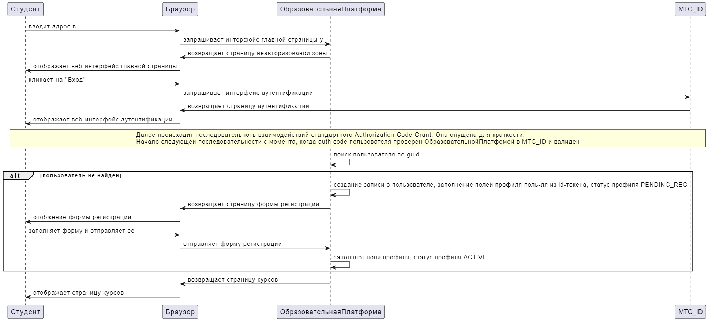

- [Title](#title)
- [Status](#status)
- [Context](#context)
- [Decision](#decision)
  - [Описание аутентификации и регистрации Студентов](#описание-аутентификации-и-регистрации-студентов)
  - [Описание аутентификации и регистрации Персонала (Преподавателей, СотрудниковПоддержки, Администраторов)](#описание-аутентификации-и-регистрации-персонала-преподавателей-сотрудниковподдержки-администраторов)
- [Alternatives](#alternatives)

# Title
Аутентификация и регистрация Студентов и Персонала в системе.

# Status
Proposed

# Context
Для системы необходимо реализовать регистрацию и аутентификацию пользователей: Студентов и Персонала(Преподавателя, СотрудникаПоддержки, Администратора). Пользователь приходит в систему как Гость (т.е. неавторизованный пользователь), далее проходит процедуру аутентификации или/и регистрации, которая включает заполнение обязательных полей (например, возраст). После успешной аутентификации/регистрации Студенты должны иметь возможность работать в системе; Персонал должен иметь возможность аутентифицироваться/зарегистрироваться. Регистрация должна быть подтверждена Администратором. Зарегистрированный Персонал может аутентифицироваться/работать в системе. Аутентифицированные пользователи получают доступ к функциям системы на основании своих ролей (Студент, Администратор и тп). Предъявляется требование к доступности в 99%.

# Decision
Для аутентификации мы будем использовать протокол OIDC (схему Authorization Code Grant), это позволит:
1. снизить цену поддержки платформы за счет делегирования хранения, управления и безопасности УЗ на стороне OIDC-поставщика
2. удобно получать информацию о пользователе (указание scope-а запрашиваемых данных, получение информации в id-токене) в идеальном случае избегая заполнения формы регистрации

В качестве провайдера идентичности мы будем использовать МТС ID, поскольку:
1. он предоставляет простой интерфейс для аутентификации (по номеру телефона и email)
2. он имеет уровень доступности 99% (класс критичности mission critical)
3. есть прямая возможность влиять на развитие функциональных возможностей (в частности реализация брокеринга идентичности популярных в РФ провайдеров идентичности: VK, Yandex, Госуслуги)

Мы разделим вход в платформу для Студентов и остальных ролей (Преподаватель, СотрудникПоддержки, Администратор). Мы сделаем это за счет формирования разных redirectUrl в url-е аутентификации. redirectUrl для Студентов будет вести на веб-приложение ОбразовательнойПлатфомы, а redirectUrl для Персонала на веб-приложение КонтрольнойПанели.

## Описание аутентификации и регистрации Студентов
Мы реализуем следующим образом аутентификацию и регистрацию новых Студентов

<details>
<summary>Исходник в plantuml</summary>

```plantuml
Студент->Браузер: вводит адрес в
Браузер->ОбразовательнаяПлатформа: запрашивает интерфейс главной страницы у
ОбразовательнаяПлатформа->Браузер: возвращает страницу неавторизованой зоны
Браузер->Студент: отображает веб-интерфейс главной страницы
Студент->Браузер: кликает на "Вход"
Браузер->МТС_ID: запрашивает интерфейс аутентификации
МТС_ID->Браузер: возвращает страницу аутентификации
Браузер->Студент: отображает веб-интерфейс аутентификации
rnote over Студент,МТС_ID
 Далее происходит последовательноть взаимодействий стандартного Authorization Code Grant. Она опущена для краткости.
 Начало следующей последовательности с момента, когда auth code пользователя проверен ОбразовательнойПлатфомой в МТС_ID и валиден
endrnote
ОбразовательнаяПлатформа->ОбразовательнаяПлатформа: поиск пользователя по guid
alt пользователь не найден 
    ОбразовательнаяПлатформа->ОбразовательнаяПлатформа: создание записи о пользователе, заполнение полей профиля поль-ля из id-токена, статус профиля PENDING_REG
    ОбразовательнаяПлатформа->Браузер: возвращает страницу формы регистрации
    Браузер->Студент: отобжение формы регистрации
    Студент->Браузер: заполняет форму и отправляет ее
    Браузер->ОбразовательнаяПлатформа: отправляет форму регистрации
    ОбразовательнаяПлатформа->ОбразовательнаяПлатформа: заполняет поля профиля, статус профиля ACTIVE
end
ОбразовательнаяПлатформа->Браузер: возвращает страницу курсов
    Браузер->Студент: отображает страницу курсов
```
</details>

Для простоты на диаграмме не отображен цикл проверки статуса профиля Студента (PENDING_REG/ACTIVE). Нахождение в статусе PENDING_REG не дает возможности входа в систему покуда не будет заполнена форма регистрации и не активирован профиль (ACTIVE).

## Описание аутентификации и регистрации Персонала (Преподавателей, СотрудниковПоддержки, Администраторов)
Мы реализуем следующим образом аутентификацию и регистрацию Персонала


<details>
<summary>Исходник в plantuml</summary>

```plantuml
Персонал->Браузер: вводит адрес в
Браузер->ПанельУправления: запрашивает интерфейс главной страницы у
ПанельУправления->Браузер: возвращает страницу неавторизованой зоны
Браузер->Персонал: отображает веб-интерфейс главной страницы
Персонал->Браузер: кликает на "Вход"
Браузер->МТС_ID: запрашивает интерфейс аутентификации
МТС_ID->Браузер: возвращает страницу аутентификации
Браузер->Персонал: отображает веб-интерфейс аутентификации
rnote over Персонал,МТС_ID
 Далее происходит последовательноть взаимодействий стандартного Authorization Code Grant. Она опущена для краткости.
 Начало следующей последовательности с момента, когда auth code пользователя проверен КонтрольнойПанелью в МТС_ID и валиден
endrnote
ПанельУправления->ПанельУправления: поиск пользователя по guid
alt пользователь найден
    ПанельУправления->Браузер: возвращает главную страницу
    Браузер->Персонал: отображает главную страницу
else пользователь не найден
    ПанельУправления->ПанельУправления: поиск хотя бы одного Администратора
    alt Администратор найден
        ПанельУправления->ПанельУправления: создание записи о пользователе, заполнение полей профиля поль-ля из id-токена, статус профиля PENDING_REG
        ПанельУправления->EmailServer: отправка уведомления о регистрации Персонала
        ПанельУправления->Браузер: возвращает страницу с уведомлением об ожидании подтверждения регистрации
    Браузер->Персонал: отобжение уведомления о регистрации
    else Администратор не найден
        ПанельУправления->ПанельУправления: зарегистрировать как Администратора
        ПанельУправления->Браузер: возвращает главную страницу
        Браузер->Персонал: отображает главную страницу
    end
end
```
</details>

Для простоты на диаграмме не отображен цикл проверки статуса профиля Персонала (PENDING_REG/ACTIVE). Нахождение в статусе PENDING_REG не дает возможности входа в систему покуда регистрация не будет одобрена Администратором.
Переход профиля Персонала из статуса PENDING_REG в ACTIVE производится Администратором в КонтрольнойПанели вручную.

**Внимание! Реализация предусматривает, что регистрация первого Администратора, должна быть произведена, до открытия публичного доступа к интерфейсу КонтрольнойПанели.**

# Alternatives
1. Реализация самописной системы управления/хранения УЗ и регистрации была рассмотрена и отброшена из-за трудоемкости дальнейшей поддержки, поскольку:
   1. потребовалось бы реализовывать и поддерживать функции "забыл пароль", "смена email", "двухфакторной аутентификации", "отзыва токена" и тп многие из которых емкие с точки зрения ИБ функций смены пароля,  и тп.
   2. отдаляет систему от интеграции с экосистемой МТС в рамках которой профиль пользователя уже может быть в МТС ID.
