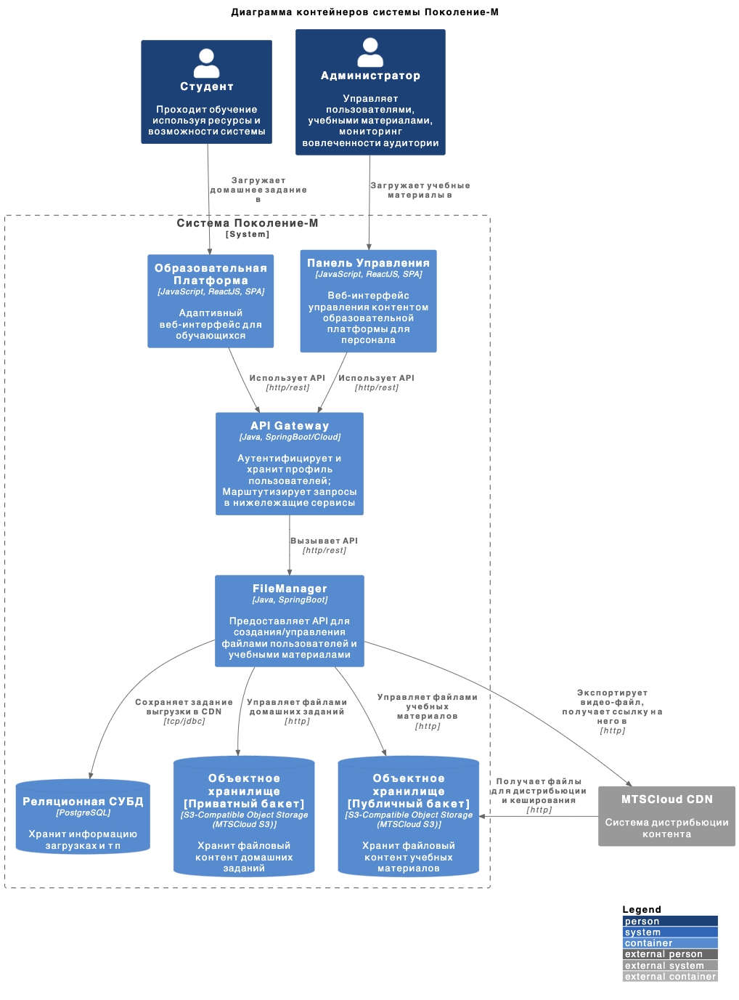

- [Title](#title)
- [Status](#status)
- [Context](#context)
- [Decision](#decision)
  - [API для загрузки/удаления/листинга файлов](#api-для-загрузкиудалениялистинга-файлов)
  - [Организация дистрибьюции файлов через CDN по модели push.](#организация-дистрибьюции-файлов-через-cdn-по-модели-push)
- [Alternatives](#alternatives)

# Title
Организация хранилища контента учебных материалов образовательной платформы и домашних заданий студентов.

# Status
Proposed

# Context
Для создания урока/курса Администраторы должны иметь возможность наполнить урок медиа-контентом (текст, звуковые дорожки, видео, картинки). Для сдачи домашних заданий Студенты должны прикреплять файлы с реализацией задания. И те и другие нужды требуют организации хранилища, которое бы позволило управлять файлами (загружать/удалять/просматривать). Кроме этого из-за геораспределенности Студентов необходимо, чтобы медиа-данные урока/курса были доставлены с минимальной задержкой.

# Decision
Для геодистрибьюции учебный материалов мы будем использовать CDN. В качестве провайдера CDN мы используем MTSCloud CDN поскольку:
- точки присутствия покрывают всю территорию РФ
- он предоставляет услуги [видеохостинга](https://cloud.mts.ru/knowledge/cdn/mediaservisy/videokhosting-i-videostriming/) (многоформатность, транскодировка, медиа-плеер)

Для хранения файлов мы будем использовать S3-совместимое объектное хранилище, поскольку оно:
1. эластично масштабируется (важно, поскольку объем медиа-данных велик)
2. одинаково хорошо подходит для файлов разных размеров (важно, поскольку в системе предполагается ипользование как больших видео-файлов так и мелких текстовых данных). 
3. предоставляет возможности хостинга статических файлов (важно для организации дистрибьюции в CDN)
Хранение пользовательких данных будет в приватном бакете, а учебных материалов в публичном. Последнее необходмо для организации доступа к файлам CDN для последующей дистрибьюции по модели pull. 

Для управления файлами (загрузки/удаления/листинга) мы реализуем сервис FileManager. Его отвественностью будет:
1. предоставления API управления файлами (загрузка/удаление/листинг)
2. организация дистрибьюции файлов через CDN по модели push.

Схема решения в виде диаграммы контейнеров:

<details>
<summary>Исходник в plantuml</summary>

```plantuml
@startuml
!include https://raw.githubusercontent.com/plantuml-stdlib/C4-PlantUML/master/C4_Container.puml

LAYOUT_WITH_LEGEND()

title Диаграмма контейнеров системы Поколение-М

Person(student, "Студент", "Проходит обучение используя ресурсы и возможности системы")
Person(admin, "Администратор", "Управляет пользователями, учебными материалами, мониторинг вовлеченности аудитории")

System_Boundary(sys, "Система Поколение-М") {
    Container(userwebapp, "Веб-Приложение Образовательной Платформы", "JavaScript, ReactJS, SPA", "Адаптивный веб-интерфейс образовательной платформы")
    Container(adminwebapp, "Веб-Приложение Панели Управления", "JavaScript, ReactJS, SPA", "Интерфейс управления контентом образовательной платформы")
    Container(gw, "API Gateway", "Java, SpringBoot/Cloud", "Аутентифицирует и хранит профиль пользователей; Марштутизирует запросы в нижележащие сервисы")
    Container(fm, "FileManager", "Java, SpringBoot", "Предоставляет API для создания/управления файлами пользователей и учебными материалами")
    ContainerDb(s3private, "Объектное хранилище [Приватный бакет]", "S3-Compatible Object Storage (MTSCloud S3)", "Хранит файловый контент домашних заданий")
    ContainerDb(s3public, "Объектное хранилище [Публичный бакет]", "S3-Compatible Object Storage (MTSCloud S3)", "Хранит файловый контент учебных материалов")
}

System_Ext(mtscloudcdn, "MTSCloud CDN", "Система дистрибьюции контента")

Rel(admin, adminwebapp, "Загружает учебные материалы в")
Rel(student, userwebapp, "Загружает домашнее задание в")

Rel(userwebapp, gw, "Использует API", "http/rest")
Rel(adminwebapp, gw, "Использует API", "http/rest")

Rel(gw, fm, "Вызывает API", "http/rest")

Rel(fm, s3private, "Управляет файлами домашних заданий", "http")
Rel(fm, s3public, "Управляет файлами учебных материалов", "http")
Rel(fm, mtscloudcdn, "Экспортирует видео-файл, получает ссылку на него в", "http")

Rel(mtscloudcdn, s3public, "Получает файлы для дистрибьюции и кеширования", "http")

@enduml
```
</details>

## API для загрузки/удаления/листинга файлов
Мы реализуем API по принципам REST. В имени rest-ресурсов мы раздели пути до ресурсов студентов ("/student/**") и учебных материалов ("/edu/**"). Эти префиксы будут использоваться для авторизации запросов согласно ролевой модели.

Мы используем уникальное строковый идентификатор студента (student slug) для формирования его каталога в системе хранения. Уникальное строковый идентификатор студента мы будем передавать в каждом запросе к FileManager и на основании его строить путь до каталога студента. Таким образом мы изолирует его доступ до данных других студентов.

## Организация дистрибьюции файлов через CDN по модели push.
Мы используем возможность CDN API для дистрибьюции видео-файлов учебных материалов по модели pull. Это позволит эффективно распространить видео-файлы по точкам присутствия, транскодировать видео и получить ссылку на конечный файл для включения в медиа-плеер. Для этого реализуем возможность указания необходимости дистрибьюции файла в FileManager REST API и сынтегрируем его c CDN.

# Alternatives
Альтернативой CDN является реализация своего CDN, что нецелесообразно.

Альтернативой использованию публичного бакета является проксирование приватного бакета через веб-сервер, что избыточно, поэтому отклонено.

Альтернативой S3 является использование СУБД или другого файлового хранилища (NFS, FTP). S3 более удобный вариант поскольку предоставляет отказоустойчивый сервис, и http-сервер для хостинга статики.