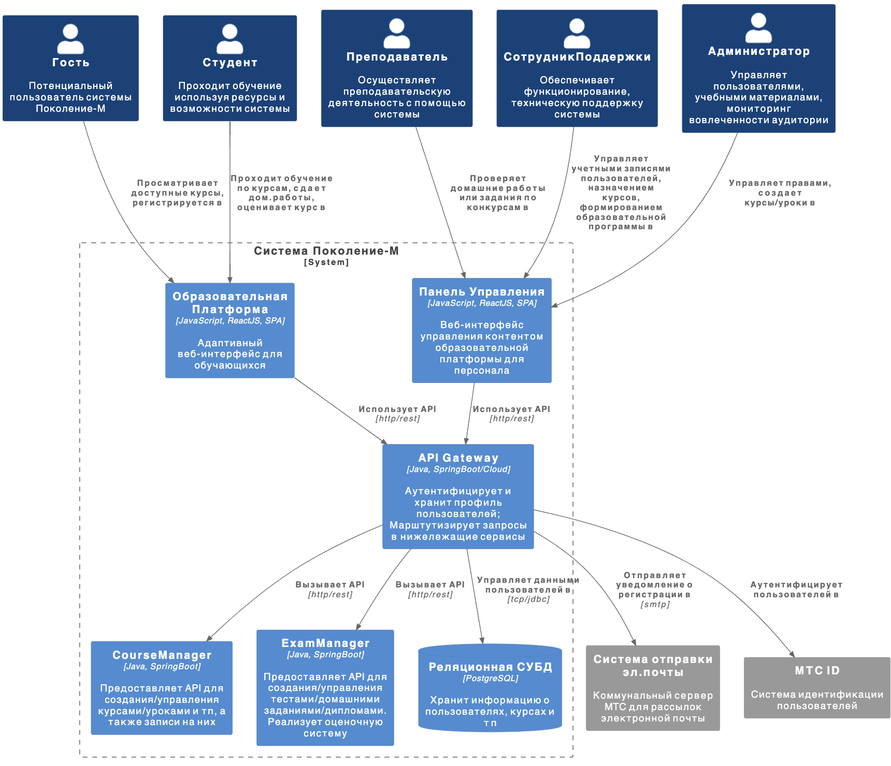
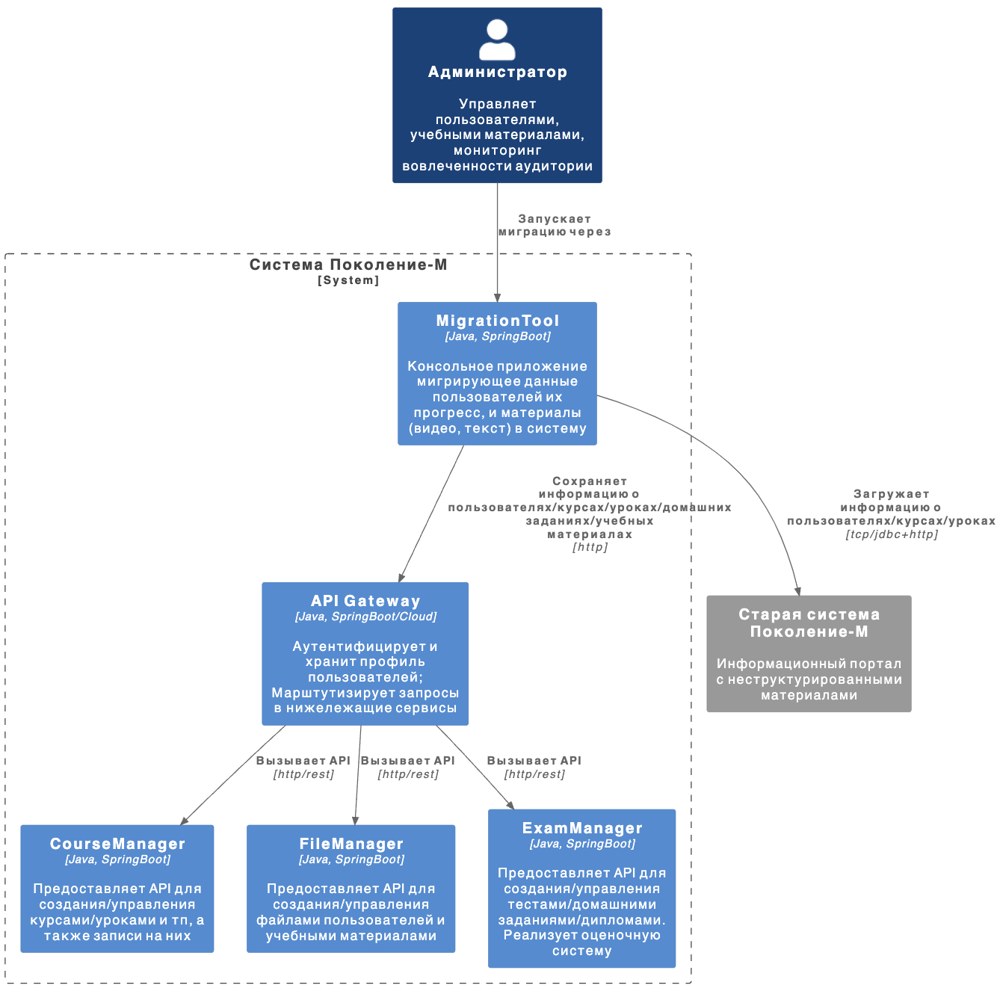

- [slide 1: Презентация команды](#slide-1-презентация-команды)
- [slide 2: Бизнес-кейс](#slide-2-бизнес-кейс)

# slide 1: Презентация команды
- Илья Карпов
- cupoftea
- Участники:
  - Алябьев Егор
  - Карпов Илья
  - Сысков Вячеслав
  - Юсупов Егор

# slide 2: Бизнес-кейс
- Образовательная платформа для развития творческих способностей детей и подростков всей страны
- Фактически является видео-хостингом со слабо структурированным контентом
- Предоставляет материалы для самостоятельного изучения, принимает домашние задания, которые проверяются вручную
- Имеет успешный кейс с запуском онлайн-активности (прослушивания в ГИТИС)
- С 3000 активных пользователей в год
- Реализована вендором:
  - Не хватает функционала
  - Проблемы с производительностью
  - Недостаточная скорость разработки
- Требуется интеграция в экосистему МТС

При этом бизнес-контекст следующий:
- Активное развитие образовательных платформ в последние 5 лет
- Развитие экосистемы МТС в направлении образовательных платформ
- Необходимость привлечения детской и подростковой аудитории в экосистему МТС

# slide 4: Озвученые цели продукта
1. Заменить продукт вендора продуктом МТС
    - изменить сайт под обновленный бренд
    - сделать продукт частью цифровой экосистемы МТС
    - реализовать продукт в соотвествии с техностратегией МТС
2. Устранить ограничения выявленные в продукте вендора
    - производительность
    - ограниченная функциональность
    - сложность модернизации
3. Достичь KPI продукта:
    - 10 млн просмотров новых уроков на сайте в год
    - 10 тыс. выданных сертификатов по итогам обучения в год

# slide 5: Системные требования: Заинтересованые стороны
- Обучающиеся
  - Гости (изучает доступные без регистрации материалы)
  - Студенты (изучает все материалы платформы)
- Персонал
  - Администратор (управляет пользователями и уч. материалами)
  - Сотрудник Поддержки (тех.поддержка пользователей)
  - Преподаватель (проверка дипломных работ, проведение активностей)

# slide 6: Системные требования: Функциональные требования
Система должна позволять:
- управлять образовательным контентом
- устраивать онлайн-активности (воркшопы, лекции, прослушивания и тп)
- оценить и проверить знания
- автоматизировать проверку домашних заданий
- поддержать ручную проверку работ
- отслеживать прогресс обучения (в том числе в ходе урока)
- выдавать сертификаты по окончании обучения
- управлять пользователями (назначением ролей)
- обеспечить миграцию данных из старой системы
- ...

... всего порядка 50 требований, которые нам удалось выделить.

# slide 7: Системные требования: Нефункциональные требования
Система должна обеспечить:
- пропускную способность на уровне не менее 10 млн. просмотров уроков в год
- одинаковый уровень производительности для пользователей разных регионов
- масштабируемость хранения данных курсов
- эластичность выч. ресурсов
- расширяемость функционала
- разграничение прав доступа пользователей
- адаптивность web-интерфейса пользователя для использование на мобильных и десктопных устройствах
- использование различных источников контента: youtube, vk, s3, cdn

# slide 8: Допущения
1. число Обучающихся на порядки превосходит число Персонала
2. эволюция обучающих материалов, структуры курсов происходит сильно быстрей, чем функционала по управлению ими
3. горизонт проектирования 3 года, рост объемов данных и траффика 100% ежегодно
4. наиболее нагруженный функционал - загрузка списка уроков/курсов, конкретного урока/курса
5. в ЧНН кол-во запросов возрастает в 3 раза
6. дети ленивы - учатся на платформе только 190 дней в году (168 учебных дней, 22 дня каникул ~ 10% от всех выходных) и не более 9 часов (c 13-00 до 22-00)
7. нагрузка распределена примерно равномерно из-за геораспределенности учеников (пренебрегаем асимметричностью распределения населения)
8. в год создается 20 курсов, в каждом 15 уроков, и еще 50 различных активностей
9. кол-во метаданных для хранения урока ~ 100KB

# slide 9: Оценочные рассчеты
- Кол-во медиа-данных:
  - 2024г: 1.7 TB (20 курсов, каждый по 85 GB)
  - 2025г: 3.4 TB (40 курсов)
  - 2025г: 6.8 TB (80 курсов)
- Кол-во просмотров уроков:
  - 2024г: 10 млн. в год
  - 2025г: 20 млн. в год
  - 2025г: 40 млн. в год
- Кол-во запросов в ЧНН:
  - 2024г: 5 rps
  - 2025г: 10 rps
  - 2025г: 20 rps
- Кол-во метаданных:
  - 2023г: 35 MB
  - 2024г: 70 MB
  - 2025г: 140 MB

# slide 10: Архитектурный стиль
Проект с:
- небольшим профилем нагрузки, но возможностями гор. масштабирования
- базовым набором функционала для образовательной платформы
- требованиями к расширяемости ф-ла без перестроения арх-ры
- выровнен с техностратегией

Выбираем архитектуру основаную на сервисах:
- более распределенная чем монолит, для удобства масштабирования и разработки
- менее распределенная чем микросервисы, поскольку пока сложно выделить ограниченные контексты, мало информации о планах
- представляет собой:
  - набор сервисов
  - сервисы ориентированы на предметные области, могут сочетать несколько предметных областей в одном
  - каждый сервис это элемент разветывания
  - каждый сервис имеет независимую БД
  - оркестрацией API-вызовов управляет API Gateway

# slide 11: Компоненты приложения: Веб-приложение
Мы выделили 2 группы интересантов веб-приложения:
- Обучающихся 
- Персонал

Из-за того, что:
1. | Обучающихся | >> | Персонал |
2. требования по usability для обучающихся выше
3. цикл изменений UI для обучающихся выше
4. требования по доступности для обучающихся выше

Мы решили разделить UI на Веб-приложение Образовательной Платформы и Веб-приложение Панели Управления. 
Оба приложения используют API Gateway для работы с бэкэндом.

# slide 12: Компоненты приложения: Управление курсами и проверкой знаний
Мы выделили в сервис Управления курсами (Course Manager) функционал платформы:
1. Организацию уроков/курсов и онлайн активностей
2. Назначение обучающихся на урок/курс
3. Треккинг прохождения урока/курса
4. Интеграцию с webinar

В сервис Управления проверкой знаний (Exam Manager) мы выделили функционал:
1. Автоматизированную/ручную проверку домашних заданий
2. Управление тестами
3. Оценочную систему

На наш взгляд эти две доменных области будут наиболее активно и независимо развиваться, поэтому выделение на начальном этапе возможно.

# slide 13: Компоненты приложения: API Gateway
Мы выделили API Gateway для:
1. Маршрутизации запросов к API
2. Аутентификации пользователей (через МТС ID)
3. Хранения информации о пользователях и их глобальных ролях (Студент, Администратор, СотрудникПоддержки)

Мы пробросили данные о ролях в заголовок вызова upstream-сервиса и делегировали авторизацию ему.

# slide 14: Компоненты приложения: File Manager и CDN
Поскольку система требует хранить большие объемы данных и обеспечивать их доступность и небольшие задержки для пользователей по всех территории РФ мы реализовали систему загрузки контента через сервис управления файлами и CDN.
Он:
1. Предоставляет API для загрузки медиа-контента уроков/курсов в публичный s3-бакет
2. Предоставляет API для загрузки домашних заданий в приватный s3-бакет
3. Обеспечивает изоляцию доступа к данным домашних заданий студентов
4. Обеспечивает интеграцию с CDN по модели push

# slide 15: Компоненты приложения: Migration Tool
Для обеспечения миграции данных мы предусмотрели Migration Tool:
1. Консольное приложение
2. Использует публичное API систмы для миграции данных из старой системы
3. Связывание старого аккаунта с новым происходит без участия Администратора (через ввод логина и пароля от старой учетной записи)

# slide 16: Интеграция: МТС Аналитика
Мы используем интеграцию МТС Аналитикой для:
- сбора логов событий пользователей (историчность)
- отслеживания конверсий
- отслеживания популярности (новых) курсов
- отслеживании кол-ва просмотров уроков (KPI)
- отслеживания кол-во и поведения новых пользователей
- и тп. действий позволяющих оценить поведение пользователей на сайте

Интеграция минимальна по трудозатратам, фактически реализует возможности по комплексному анализу поведения пользователей на сайте.

# slide 16: Диаграмма контейнеров

# slide 17: Диаграмма контекстов

# slide 18: Инфраструктура
1. Управляемый сервис Kubernetes в Ocean
2. Управляемый сервис PostgreSQL в Ocean
3. S3 + CDN от MTSCloud
4. Observability Platform + Mission Control Center
5. Fortiweb WAF + qrator anti-ddos

# slide 19: Оценка проекта
Решение предоставляет:
1. Замену продукта вендора с возможностью миграции контента (архитектура + MigrationTool)
2. Интеграцию с цифровой экосисистемой МТС (МТС ID, Webinar, МТС Аналитика)
3. Соответствие техностратегии МТС (соответствие CN-принципам, вектор на микросервисную архитектуру с разумным компромиссом на старте)
4. Устранены ограничения вендора:
   1. Производительность (за счет CDN, кеширования контента)
   2. Ограниченная функциональность (за счет сервисной архитектуры)
   3. Сложность модернизации (за счет сервисной архитектуры)
5. Достижимость KPI:
   1. 10 млн просмотров новых уроков на сайте в год (за счет арх-ры + мониторинг метрики через МТС Аналитику)
   2. 10 тыс. выданных сертификатов по итогам обучения в год (за счет масштабируемости платформы увеличением кол-ва предлагаемых курсов)

# slide 20: Вопросы