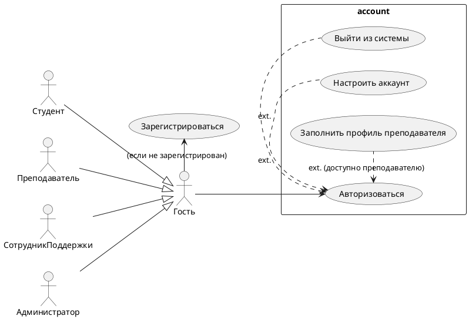
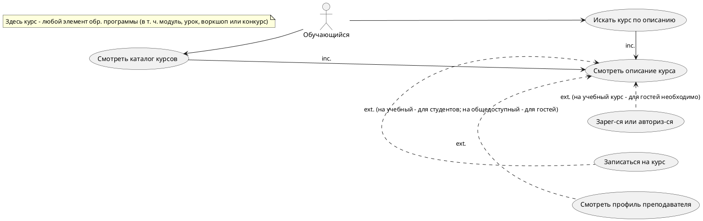
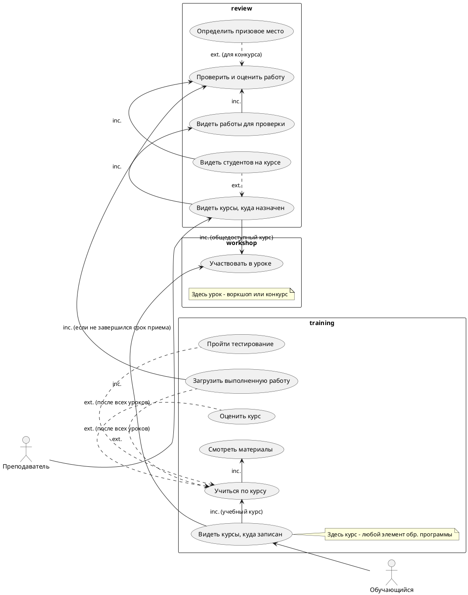
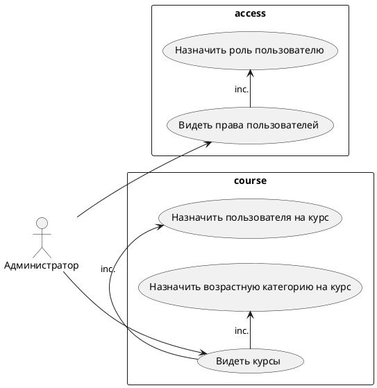

# Описание требований к решению

- [Описание требований к решению](#описание-требований-к-решению)
  - [Заинтересованные стороны](#заинтересованные-стороны)
  - [Бизнес-контекст (БТ)](#бизнес-контекст-бт)
  - [Глоссарий (ТЕР)](#глоссарий-тер)
  - [Требования к системе](#требования-к-системе)
    - [Варианты использования (ВИ)](#варианты-использования-ви)
    - [Варианты использования при работе с аккаунтом](#варианты-использования-при-работе-с-аккаунтом)
    - [Варианты использования, возникащие про просмотре курсов](#варианты-использования-возникащие-про-просмотре-курсов)
    - [Варианты использования, возникащие при обучении](#варианты-использования-возникащие-при-обучении)
    - [Варианты использования, возникающие при администрировании](#варианты-использования-возникающие-при-администрировании)
    - [Функциональные требования (ФТ)](#функциональные-требования-фт)
    - [Нефункциональные требования (НФТ)](#нефункциональные-требования-нфт)
    - [Ограничения (ОГ)](#ограничения-ог)

## Заинтересованные стороны
| Заинтересованная сторона | Интересы           |
|:-------------------------|:-------------------|
| Гость | <ul><li>Найти интересующие курсы</li><li>Ознакомиться с аннотациями к элементам и материалам курса</li></ul> |
| Студент                | <ul><li>Изучить интересующий курс</li><li>Получить сертификат прохождения курса</li><li>Иметь возможность получать обратную связь по урокам и домашним заданиям: задавать вопросы, получать оценки, коммуницировать с другими Студентами</li></ul> |
| Преподаватель               | <ul><li>Иметь удобный инструмент проверки домашних заданий Студентов</li><li>Получать обратную связь от Студентов: вопросы, домашки, отзывы</li></ul> |
| Администратор               | <ul><li>Управлять правами пользователей, размещением и доступностью материалов, подтверждать корректность загруженных материалов</li></ul> |
| Сотрудник поддержки | <ul><li>Обеспечить функционирование системы и техническую поддержку пользователей</li></ul>  |
| Cпециалист по кадрам | <ul><li>Привлечь Студентов на стажировку</li></ul> |
| Заказчик | <ul><li>Продвижение бренда компании и ее позиционирование как IT-компании</li></ul> |

## Бизнес-контекст (БТ)
| Раздел | Описание           |
|:-------------------------|:-------------------|
| Предпосылки (текущее состояние) | <ul><li>Сайт устроен как информационный портал с неструктурированными материалами (документы с лекциями, презентации, записанные видео), которые предлагается читать и просматривать в любом порядке.</li><li>Сайт не предоставляет преподавателям функции автоматизации для проверки домашних заданий, информация о них приходит им на почту.</li><li>Преподаватели, администраторы не могут планировать учебную работу, уроки не сгруппированы в модули, курсы, образовательные программы.</li><li>Администратор не видит общей картины по числу проходящих обучение, выполненных домашних работ, их распределение по направлениям, распределение просмотров и отзывов по курсам, преподавателям.</li><li>Заказчику не видно какие направления наиболее востребованы, куда (на какую аудиторию, по каким направлениям) необходимо развивать сайт.</li><li>Сайт реализован вендором, его архитектура сейчас не предусматривает возможность развития как образовательной платформы в виду низкой производительности, ограниченной функциональности, сложности модернизации).</li><li>Сайт, в том числе сами курсы, не позиционируют МТС как IT-компанию, которая разрабатывает современные, полезные в разных отраслях IT-решения.</li></ul>|
| Возможности бизнеса | <ul><li>Последние 5 лет активно развиваются образовательные онлайн-платформы, в частности по направлениям, связанным с компьютерными технологиями и творчеством.</li><li>Компания МТС планирует развивать собственную образовательную площадку, привлекать внимание новой аудитории к экосистеме МТС, продвигать свои технологии за счет бесплатных курсов по актуальным и востребованным направлениям.</li></ul>|
| Масштаб и ограничения текущей версии (v1) | <ul><li>Срок сдачи - 30 сентября 2024 г.</li><li>На момент релиза будет доступно 20 образовательных курсов, а также старый контент (с текущего решения от вендора).</li><li>Доли полу-развлекательного и учебного контента сотсавляют - 40% \ 60%.</li><li>Курсы подготавливаются вне системы: срествами команды заказчика, покупаются по заказу.</li><li>Аудитория - дети и подростки. Большая часть курсов будет нацелена на подростков 12-15 лет, которые активны в интернете.</li><li>Веб-версия приложения.</li><li>Видео-контент адаптируется к разрешению экрана устройства, к пропускной способности канала передачи данных.</li><li>Взаимодействие с пользователями через электронную почту, по выполнению заданий - в соц. сетях.</li><li>Первая версия приложения в виде веб-приложения для стационарных и мобильных устройств.</li></ul> |
| Масштаб и ограничения последующих версий (v2) | <ul><li>Взаимодействие с пользователями через соц. сети, SMS.</li><li>Версия приложения на платформе Android.</li><li>Автоматизация расчетов на благотворительность.</li><li>Для хранения видео-контента используется только WASD.</li><li>Материалы курсов автоматически доступны в корпоративном университете МТС.</li></ul> |
| Бизнес-требования | Описание целей и критериев успеха (новой системы) |
| БТ.01 | Для гостей система обеспечивает беспрепятственный доступ на сайт, участвовать в открытых, воркшопах, возможность записаться на обучение по любому направлению, для абонентов МТС - использовать баллы МТС |
| БТ.02 | Для студентов за счет удобства система суммарно обеспечивает 10 млн. просмотров новых уроков на сайте в год |
| БТ.03 | Для преподавателей система обеспечивает автоматизацию учета выполнения курсов, работы со студентами, что сокращает затраты времени |
| БТ.04 | Для администраторов система обеспечивает автоматизацию добавления курсов, управления процессом обучения, мониторинга вовлеченности аудитории, что сокращает затраты времени |
| БТ.05 | Для специалистов по кадрам система обеспечивает возможность использования материалов в корпоративном университете за счет интеграции, рассмотрения новых кандидатов для стажировки за счет рассмотрения 10 тыс. выданных сертификатов по итогам обучения в год |
| БТ.06 | Для заказчика система обеспечивает возможность развития собственной, интегрированной в экосистему МТС, образовательной платформы, распространение материалов о продвигаемых продуктах, знаний об использовании технологий экосистемы МТС (в частности, чтобы повысить их популярность, привлекать новых IT-специалистов) |
| Образ решения | <ul><li>Новая система заменяет текущее решение. Она обеспечивает структурирование и организацию учебных материалов по направлениям, по уровням каждого элемента образовательной программы (курс, модуль, урок), в определенном порядке.</li><li>Новая система предоставляет функции автоматизации проверки уровня усвоения знаний, проверки домашних заданий.</li><li>Новая система позволяет организовывать и управлять процессом обучения, видеть общую картину по заинтересованности аудитории, востребованности и актуальности курсов, имеет возможности мониторинга работы пользователей и самого учебного процесса.</li><li>Новая система имеет возможности ее поэтапной или точечной доработки, обеспечения работы при существенном расширении аудитории на базе имеющейся в МТС инфраструктуры, существующих в МТС наработок и технологий, поддержки имеющимся в МТС (Диджитал) персоналом, а также имеет возможности мониторинга компонентов системы.</li><li>Новая система в будущем должна иметь возможность предоставления платных образовательных услуг.</li></ul> |

## Глоссарий (ТЕР)
| Понятие                        | Сокращение                         | Определение                       |
|:-------------------------------|:-----------------------------------|:----------------------------------|
| Система | | Разрабатываемая образовательная платформа |
| Образовательная программа | | Набор из нескольких курсов |
| Курс | | Конкретный образовательный курс, в который входям несколько учебных модулей |
| Модуль | | Логически законченный раздел курса, состоящий из нескольких уроков, объединенных по теме |
| Урок | | Часть модуля, изучаемая студентом в течение одного занятия, содержит различные учебные материалы |
| Учебный материал | | Совокупность доступных для изучения образовательной программы или курса: конспектов, презентаций, записанных видео, воркшопов |
| Воркшоп | | Прямая трансляция видео в рамках обучения студентов, либо для маркетинговых целей для гостей (например, онлайн-хакатон, онлайн-квиз, онлайн тотальный диктант) |
| Конкурс | | Урок с ручной проверкой заданий, в рамках обучения студентов, либо для маркетинговых целей не относящиеся к курсам, доступный для всех гостей |
| Выполненное (домашнее) задание | | Текстовый документ, ответы по тесту, рисунок, видео-работа |
| Признак | |  Классификатор (имя) группы категорий (например, уровень образования; отрасль знаний; специализация) | 
| Категория | | Конкретная категория, относящаяся к признаку (например: среднее образование, высшее образование; информатика, история) |
| Оценка | | То, как преподаватель оценил выполнение студентом того или иного элемента образовательной программы |
| Рейтинг | | То, как студент оценивает качество курса |
| Обучающийся | | Объединение ролей Гость, Студент |
| Персонал | | Объединение ролей Администратор, СотрудникПоддержки, Преподаватель |

## Требования к системе

### Варианты использования (ВИ)

### Варианты использования при работе с аккаунтом

### Варианты использования, возникащие про просмотре курсов

### Варианты использования, возникащие при обучении

### Варианты использования, возникающие при администрировании

### Функциональные требования (ФТ)

| ID     | Система должна позволять              | Функциональный блок | Версия |
|--------|---------------------------------------| ---- | ---- |
| СА.002 | Группировать пользователей по организациям(возрасту, региону)/курсам/активностям к которым они будут иметь доступ | Управление пользователями | v1 |
| СА.003 | Хранить образовательной и полу-развлекательный контент в текстовом виде, в виде графических, медиа и офисных документов, а также в видеоформате | Управление материалами | v1 |
| СА.004 | Автоматический прием (учет факта загрузки) домашней работы или задания по конкурсу на проверку | Домашняя работа | v1 |
| СА.005 | Автоматическое выставление оценки по домашней работе (да, нет) | Домашняя работа | v1 |
| СА.006 | Отслеживать прогресс прохождения/просмотра урока | Управление прогрессом обучения | v1 |
| СА.007 | Открывать следующий урок только после прохождения предыдущего | Управление прогрессом обучения | v1 |
| СА.008 | Ограничивать доступ к курсам и их материалам исходя из возрастных ограничений | Управление курсами | v1 |
| СА.009 | Учитывать кол-во выданных сертификатов | Управление курсами | v1 |
| СА.010 | Регистрировать просмотры уроков | Аналитика | v1 |
| СА.011 | Позволять проводить онлайн-активности через Webinar | Онлайн-активности | v1 |
| СА.012 | Предоставлять доступ к возможностям нейросети МТС | Интеграция с нейросетями МТС | v2 |
| СА.013 | Позволять работать как через web-интерфейс так и через mobile | Пользовательский опыт | v2 |
| СА.014 | Позволять замерить влияние образовательной платформы на другие продукты экосистемы (PR-эффект) | Аналитика | v2 |
| СА.023 | Автоматический размещать на платформе данные об отчислениях на благотворительность за последний отчетный период | Управление уведомлениями | v2 |

---

| ID | Гость должен иметь возможность | Функциональный блок | Версия |
|--------|---------------------------------------| ---- | ---- |
| Г.001 | Создания аккаунта пользователя из графического интерфейса (требуется указание: msisdn, email) | Управление профилем | v1 |
| Г.002 | Авторизации в системе при наличии аккаунта | Управление профилем | v1 |
| Г.003 | Выхода пользователя из системы, если он авторизован | Управление профилем | v1 |
| Г.004 | Заявлять о своем статусе как о преподавателе или студенте | Управление профилем | v1 |
| Г.101 | Просмотра описаний образовательных программ, курсов по выбранному направлению даже без авторизации | Управление курсами | v1 |
| Г.102 | Поиска модулей, уроков по его теме, аннотации, тезисам, ключевым словам | Управление курсами | v1 |
| Г.103 | Просмотра полу-развлекательного контента (курсов, модулей, уроков), не подразумевающего оценку заданий | Управление курсами | v1 |
| Г.104 | Участия в онлайн активностях (в том числе воркшопах) | Онлайн-активности | v1 |
| Г.202 | Доступа к маркетинговым материалам: записанные видео доступны для просмотра в любое время | Управление курсами | v1 |

---

| ID     | Студент должен иметь возможность             | Функциональный блок | Версия |
|--------|---------------------------------------| ---- | ---- |
| С.001 | Проходить курс (модуль), изучая модули (уроки) по очереди | Управление курсами | v1 |
| ~~С.002~~ | Проходить тестирование после прохождения урока/модуля/курса (можно удалить, тоже самое что С.003) | Тестирование знаний | Снято |
| С.003 | Проходить тестирование на определение уровня знаний по любому пройденному элементу образовательной программы, если это предусмотрено для этого элемента | Тестирование знаний | v1 |
| С.004 | Загрузить выполненную (домашнюю) работу по уроку в систему | Управление материалами | v1 |
| С.100 | Настраивать аккаунт пользователя из графического интерфейса (указания своего фио, даты рождения (возраста), региона, ссылки на свои страницы из соц. сетей) | Управление профилем | v1 |
| С.103 | Оценивать элементы образовательных программам по пятибальной шкале | Управление курсами | v1 |
| С.105 | Просматривать список отдельных уроков (воркшопов, конкурсов), курсов, образовательных программ, на которые записан | Управление курсами | v1 |
| С.106 | Записываться на курс/образовательную программу | Управление курсами | v1 |
| С.201 | Доступа к материалам для обучения: конспекты, презентации доступны для скачивания по ходу прохождения курса | Управление материалами | v1 |
| С.202 | Доступа к материалам для обучения: записанные видео доступны для просмотра по ходу прохождения курса | Управление материалами | v1 |
| С.202 | Доступа к материалам для обучения: трансляции доступны для просмотра в онлайн | Управление материалами | v1 |

---

| ID     | Преподаватель должен иметь возможность             | Функциональный блок | Версия |
|--------|---------------------------------------| ---- | ---- |
| ~~ПП.001~~ | Ограничивать кол-во студентов на курсе | Управление курсами | Снято в связи с А.004 |
| ПП.003 | Проводить воркшоп для гостей или для студентов в рамках курса | Онлайн-активности | v1 |
| ПП.091 | Заполнять свой профиль для его отображения гостям | Управление профилем | v1 |
| ПП.102 | Просматривать и оценивать итоговые работы по его курсу, назначенного ему студента | Домашняя работа | v1 |
| ПП.104 | Просматривать список студентов на своих курсах. Группировать их по различным категориям | Управление студентами | v1 |
| ПП.105 | Определяеть победителей, распределять места в конкурсах (может быть 3 места) | Тестирование знаний | v1 |

---

| ID     | Администратор должен иметь возможность             | Функциональный блок | Версия |
|--------|---------------------------------------| ---- | ---- |
| А.001 | Управлять учетными записями: назначать одну или несколько ролей для пользоватлея | Управление УЗ | v1 |
| ~~А.002~~ | Управлять назначением студентов к преподавателю по курсам | Управление курсами | Снято в связи с С.106, А.004 |
| ~~А.003~~ | Проверять корректность и полноту курса | Управление курсами | Снято в связи с ОГ.010 |
| А.004 | Назначать преподавателя (одного или нескольких) на курс, который будет (которые будут) оценивать работы студентов | Управление курсами | v1 |
| А.101 | Добавлять курс, а также его дочерние элементы с учебными материалами (в т. ч. редактировать их, управлять их порядком) от лица (автор указывается как) МТС | Управление курсами | v1 |
| А.102 | Для курса установить минимальную возрастную категорию | Управление курсами | v1 |
| А.104 | Просматривать список студентов на курсах. Группировать их по различным категориям | Управление курсами | v1 |
| А.121 | Вести категории для заданных в системе признаков (добавлять, редактировать, удалять неиспользуемые категории для каждого из признаков) | Управление курсами | v1 |
| А.123 | Для элемента образовательной программы назначать категории по признакам: направление, возрастная категория и т. д. | Управление курсами | v1 |
| А.124 | Для пользователя назначать категории по соответсвующим признакам: специализация и т. д. | Управление пользователями | v1 |
| А.111 | Для рекламных целей добавлять конкурс для гостей с указанием даты и времени окончания приема домашних заданий | Управление курсами | v1 |
| А.112 | Для рекламных целей добавлять воркшоп для гостей с указанием даты и времени его проведения | Управление курсами | v1 |
| А.106 | Отслеживать какие модули \ курсы \ уроки прошли студенты | Управление курсами | v1 |
| А.108 | Рассчитывать и формировать отчет о том, сколько необходимо отчислить на благотворительность на основе конверсионных действий за отчетный период | Биллинг | v2 |

---

| ID     | Сотрудник Поддержки должен иметь возможность             | Функциональный блок |
|--------|---------------------------------------| ---- |
| СП.001 | Управлять учетными записями (заведением учителей, администраторов). | Управление УЗ | v1 |
| ~~СП.002~~ | Управлять назначением студентов учителям | - | Снятно в связи с С.106 |
| СП.003 | Управлять классификаторами, а также назначать категории конкретным сущностям системы (пользователям, курсам) | Управление курсами | v1 |
| СП.004 | Управлять структурой курсов | Управление курсами | v1 |
| СП.005 | Формировать учебные материалы и загружать их на портал | Управление материалами | v1 |

---

| ID     | Система должна быть спроектирована с учетом             | Функциональный блок | Версия |
|--------|---------------------------------------| ---- | ---- |
| СД.001 | Переноса контента (структура и описание курсов, данные пользователей) из реляционной СУБД (текущей реализации от вендора) текущей реализации в новую систему | Миграция | v1 |
| СД.002 | Переноса контента (учебные материалы, домашние задания) из хранлища данных S3 (текущей реализации от вендора) в новую систему | Миграция | v1 |
| СД.101 | Возможности внедрения оплаты курсов баллами МТС (кешбек), использование в пакете "Премиум" | Биллинг | v2 |
| СД.102 | Возможности внедрения оплаты курсов дебетовой картой, интернет-деньгами и последующей монетизации контента | Биллинг | v2 |

---

### Нефункциональные требования (НФТ)

| ID     | Атрибут качества             |  Система должна обеспечивать                       | 
|--------|------------------------------|-------------------------------------------|
|  | | <b>Стандарты качества</b> |
| НФТ.001 | portability | Источники видео контента, внешние: Youtube, VK, WASD |
| НФТ.002 | portability | Источники видео контента, внутренние: MTS CDN, MTS S3 |
| НФТ.003 | scalability | Возможность работы не менее 10000 пользователей в год |
| НФТ.004 | scalability | Возможность одновременного участия в воркшопе не менее 500 пользователей системы |
| НФТ.005 | availability | Доступность 99% |
| НФТ.006 | performance | Время обработки запроса пользователя, выполненного из графического интерфейса, не более чем 3 секунды (Допущение!) |
| НФТ.010 | usability | Адаптивность web-интерфейса пользователя под размер экрана любого устройства, выпущенного не более 5 лет назад |
| НФТ.011 | extensibility | Расширяемость возможности проведения образовательных активностей: онлайн-квизы, всероссийские олимпиады, хакатоны и пр. |
| НФТ.012 | elasticity | Эластичность выделения выч.ресрусов в случае увеличения нагрузки |
| НФТ.013 | performance | Одинаковую производительной для студентов из всех регионов РФ |
| НФТ.014 | observability | Мониторинг и реакцию на нештатные ситуации |
| НФТ.015 | scalability | Хранение большого объема данных учебных материалов (пример: 1 курс ~ 85ГБ, планово иметь 20 курсов) |
| НФТ.2xx |  | <b>Требования к разработке и внедрению функционала</b> |  |
| НФТ.203 | testablitily | Модули системы должны обеспечивать их тестируемость, проверку на предмет дефектов отдельно от друг от друга, в том числе и на этапах их разработки (если они не готовы) и при последующей доработке, замены одних на другие |
| НФТ.204 | maintainability | Изменение существующего функционала (обновление пользовательских функций) не должно приводить к драматическим измнениям в коде (переписыванию, удалению всего модуля), а добавление нового функционала (новых пользовательских функций) к переработке всей архитектуры |
| НФТ.3xx |  | <b>Целостность и безопасность</b> |
| НФТ.301 | security | Разграничение доступа пользователей к тем или иным функциям по ролям: Гость, Студент, Преподаватель, Сотрудник поддержки, Администратор |
| НФТ.302 | security | Разграничение доступа пользователей к данным, в т. ч. учебным материалам, по классам обрабатываемой информации: Тайна связи, Персональные данные, Коммерческая тайна, Общедоступная информация |
| НФТ.303 | security | Конфиденциальность личных данных пользователей, внесенных в систему, в т. ч. данных студентов для связи с ними |
| НФТ.304 | security | Ведение журнала работы как минимум на уровне основных функций для гостей и студентов, заданных в функциональных требованиях |

### Ограничения (ОГ)

| ID     | Ограничения | Описание требования |
|--------|------------------------------|-------------------------------------------|
| ОГ.001     | Формат работы | Студенты, преподаватели, сотрудники поддержки работают онлайн, для работы у них имеются ПК (ноутбуки) с доступом в интернет |
| ОГ.002     | Язык | Язык системы и курсов - русский | MVP |
| ОГ.004     | Один преподаватель | На курсе должен быть хотя бы один преподаватель |
| ОГ.005     | География | География пользователей - Россия |
| ОГ.008 | Рисунки | Рисунки в электронном формате jpg, jpeg, png |
| ОГ.009 | Видео-контент | Видео-контент транслируется в исходном разрешении, подготовленном по заданию заказчика (FHD) |
| ОГ.010 | Контент | Материалы курса (весь контент) подготавливаются по заданию заказчика вне системы, заранее | 
| ОГ.011 | Компоненты | В разработке используются, разрешенные \ принятые в МТС компоненты (отмечены как разрешенные в технологическом радаре МТС) |
| ОГ.012 | Библиотеки | В разработке используются официальные библиотеки разработки |